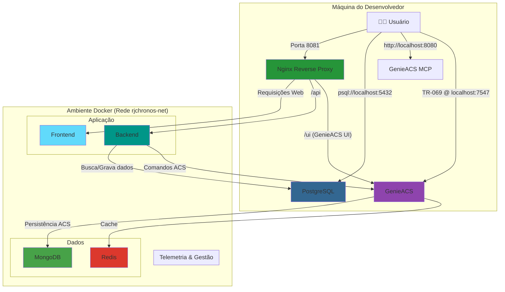

# Guia do Ambiente de Desenvolvimento

Este documento descreve como configurar e executar o ambiente de desenvolvimento local do RJChronosConnect usando Docker.

## 1. Pré-requisitos

-   **Docker:** [Instruções de instalação](https://docs.docker.com/get-docker/)
-   **Docker Compose:** Geralmente já vem incluído com o Docker Desktop.

## 2. Visão Geral da Arquitetura

O projeto utiliza dois arquivos `docker-compose` para separar os ambientes:

-   `docker-compose.yml`: Contém a configuração base, otimizada para **produção**.
-   `docker-compose.dev.yml`: Contém as **modificações** para o ambiente de **desenvolvimento**. Ele sobrescreve configurações do arquivo base, como usar os `Dockerfile.dev` e adicionar volumes para live-reload.

O serviço do `genieacs` é uma exceção e mantém a mesma configuração em ambos os ambientes.

## 3. Como Iniciar o Ambiente de Desenvolvimento

1.  **Configure as Variáveis de Ambiente:**
    Copie o arquivo `.env.example` e renomeie-o para `.env`. Preencha as variáveis, especialmente as credenciais do banco de dados `POSTGRES`.

2.  **Suba os Contêineres:**
    A partir da raiz do projeto, execute o seguinte comando para combinar os dois arquivos e iniciar o ambiente:

    ```bash
    # Este comando combina o arquivo base com o de desenvolvimento
    docker-compose -f docker-compose.yml -f docker-compose.dev.yml up --build
    ```

    -   O comando irá construir as imagens usando os `Dockerfile.dev` e depois iniciar todos os serviços com live-reload ativado.
    -   Para parar o ambiente, pressione `Ctrl + C` e depois execute `docker-compose -f docker-compose.yml -f docker-compose.dev.yml down`.

## 4. Diagrama da Arquitetura de Desenvolvimento

O diagrama abaixo ilustra os principais serviços e como eles se conectam no ambiente de desenvolvimento.



## 5. Detalhes dos Serviços e Portas (Ambiente DEV)

| Serviço         | Build (Dockerfile) | Volumes (Live-Reload)      | Portas (Host) | Propósito                                     |
| --------------- | ------------------ | -------------------------- | ------------- | --------------------------------------------- |
| `frontend`      | `Dockerfile.dev`   | `./services/frontend:/app` | -             | Interface de usuário em React.                |
| `backend`       | `Dockerfile.dev`   | `./services/backend-api:/app` | -             | API principal em FastAPI.                     |
| `genieacs`      | `Dockerfile`       | -                          | 7547, 7557    | Servidor TR-069 (configuração igual à prod).  |
| `reverse-proxy` | -                  | -                          | 8081          | Ponto de entrada único (Nginx).               |
| `db-app`        | -                  | -                          | 5432          | Banco de dados PostgreSQL para o backend.     |
| `genieacs-mcp`  | -                  | -                          | 8080          | Painel de controle adicional para o GenieACS. |

## 6. Principais Pontos de Acesso

-   **Aplicação Principal:** `http://localhost:8081`
-   **API do Backend:** `http://localhost:8081/api`
-   **UI do GenieACS:** `http://localhost:8081/ui`
-   **Painel GenieACS-MCP:** `http://localhost:8080`
-   **Banco de Dados (PostgreSQL):** `psql -h localhost -p 5432 -U <user> -d <db>`
