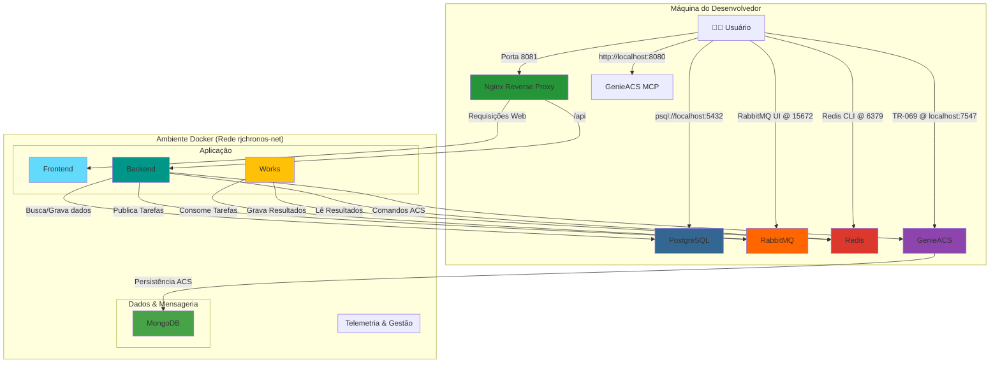

# Guia do Ambiente de Desenvolvimento

Este documento descreve como configurar e executar o ambiente de desenvolvimento local do RJChronosConnect usando Docker.

## 1. Pré-requisitos

-   **Docker:** [Instruções de instalação](https://docs.docker.com/get-docker/)
-   **Docker Compose:** Geralmente já vem incluído com o Docker Desktop.

## 2. Visão Geral da Arquitetura

O projeto utiliza dois arquivos `docker-compose` para separar os ambientes:

-   `docker-compose.yml`: Contém a configuração base, otimizada para **produção**.
-   `docker-compose.dev.yml`: Contém as **modificações** para o ambiente de **desenvolvimento**. Ele sobrescreve configurações do arquivo base, como usar os `Dockerfile.dev` e adicionar volumes para live-reload.

O serviço do `genieacs` é uma exceção e mantém a mesma configuração em ambos os ambientes.

## 3. Como Iniciar o Ambiente de Desenvolvimento

1.  **Configure as Variáveis de Ambiente:**
    Copie o arquivo `.env.example` e renomeie-o para `.env`. Preencha as variáveis, especialmente as credenciais do banco de dados `POSTGRES`.

2.  **Suba os Contêineres:**
    A partir da raiz do projeto, execute o seguinte comando para combinar os dois arquivos e iniciar o ambiente:

    ```bash
    # Este comando combina o arquivo base com o de desenvolvimento
    docker-compose -f docker-compose.yml -f docker-compose.dev.yml up --build
    ```

    -   O comando irá construir as imagens usando os `Dockerfile.dev` e depois iniciar todos os serviços com live-reload ativado.
    -   Para parar o ambiente, pressione `Ctrl + C` e depois execute `docker-compose -f docker-compose.yml -f docker-compose.dev.yml down`.

## 4. Diagrama da Arquitetura de Desenvolvimento

O diagrama abaixo ilustra os principais serviços e como eles se conectam no ambiente de desenvolvimento.



## 5. Detalhes dos Serviços e Portas (Ambiente DEV)

| Serviço         | Build (Dockerfile) | Volumes (Live-Reload)      | Portas (Host) | Propósito                                     |
| --------------- | ------------------ | -------------------------- | ------------- | ---------------------------------------------------- |
| `reverse-proxy` | -                  | -                          | 8081          | Ponto de entrada único (Nginx) para todos os serviços. |
| `frontend`      | `Dockerfile.dev`   | `./services/frontend:/app` | -             | Interface de usuário em React.                |
| `backend`       | `Dockerfile.dev`   | `./services/backend-api:/app` | -             | API principal em FastAPI.                     |
| `works`         | `Dockerfile.dev`   | `./services/works:/app`    | -             | Worker para processamento de tarefas assíncronas.    |
| `genieacs`      | `Dockerfile`       | -                          | 7547, 7557    | Servidor TR-069 (configuração igual à prod).  |
| `genieacs-mcp`  | -                  | -                          | 8080          | Painel de controle adicional para o GenieACS. |
| `db-app`        | -                  | -                          | 5432          | Banco de dados PostgreSQL para o backend.     |
| `db-acs`        | -                  | -                          | -             | Banco de dados MongoDB para o GenieACS.       |
| `redis`         | -                  | -                          | 6379          | Armazenamento de resultados de tarefas e cache.      |
| `rabbitmq`      | -                  | -                          | 5672, 15672   | Fila de mensagens para tarefas assíncronas.   |

## 6. Detalhamento dos Componentes

Esta seção detalha cada serviço (contêiner) que compõe o ambiente de desenvolvimento.

### 6.1 `reverse-proxy` (Nginx)
- **O que é?** Um servidor web Nginx que atua como um proxy reverso. É o único ponto de entrada para o ambiente a partir da sua máquina.
- **Por que utilizar?** Simplifica o acesso aos múltiplos serviços. Em vez de decorar a porta de cada serviço (`frontend`, `backend`, `genieacs-ui`), você acessa tudo pela porta `8081`. Ele direciona sua requisição para o contêiner correto com base no caminho (URL).
- **Formas de utilizar:**
  - Acessar a interface principal: `http://localhost:8081`
  - Enviar requisições para a API: `http://localhost:8081/api/...`
  - Acessar a UI do GenieACS: `http://localhost:8081/ui`

### 6.2 `frontend`
- **O que é?** A aplicação de interface de usuário (UI), construída com React.
- **Por que utilizar?** É a camada de apresentação com a qual o usuário final interage. O uso de React com Vite permite um desenvolvimento moderno, rápido e uma experiência de usuário rica e reativa.
- **Formas de utilizar:** É a interface gráfica principal do sistema, acessada pelo navegador.

### 6.3 `backend`
- **O que é?** A API principal, construída com Python e FastAPI. É o cérebro da aplicação.
- **Por que utilizar?** FastAPI oferece altíssima performance e é ideal para aplicações com muitas operações de I/O (rede, banco de dados), como é o caso do RJChronos. Ele gerencia a lógica de negócio, autenticação e a comunicação com os outros serviços.
- **Formas de utilizar:** O `frontend` consome esta API para exibir dados e executar ações. Você também pode interagir diretamente com ela para testes ou integrações via `http://localhost:8081/api`.

### 6.4 `works`
- **O que é?** Um novo serviço "trabalhador" (worker) em Python.
- **Por que utilizar?** Ele é dedicado a executar tarefas pesadas e demoradas (ex: atualizar firmware de 1000 aparelhos) que são enviadas pelo `backend` através do RabbitMQ. Isso impede que a API e a interface do usuário travem. Podemos escalar o número de workers para aumentar a capacidade de processamento.
- **Formas de utilizar:** Você não interage com ele diretamente. O `backend` envia tarefas para a fila e o `works` as consome automaticamente. Veja a seção "Arquitetura de Tarefas Assíncronas" na documentação de especificação para detalhes de implementação.

### 6.5 `rabbitmq`
- **O que é?** Um "Message Broker" ou "Fila de Mensagens".
- **Por que utilizar?** Garante a comunicação confiável e assíncrona entre o `backend` e o `works`. Se o `works` estiver ocupado ou offline, o RabbitMQ guarda a tarefa em segurança até que ela possa ser processada. Isso previne a perda de dados e comandos.
- **Formas de utilizar:**
  - **UI de Gerenciamento:** Acesse `http://localhost:15672` (usuário/senha: `guest`/`guest`) para ver as filas, o fluxo de mensagens e o estado do broker.
  - **Na aplicação:** Usado para enfileirar qualquer tarefa que não precise de uma resposta imediata.

### 6.6 `redis`
- **O que é?** Um banco de dados em memória extremamente rápido.
- **Por que utilizar?** É perfeito para dados que precisam ser acessados com baixíssima latência.
- **Formas de utilizar:**
  - **Resultados de Tarefas:** O serviço `works` salva o resultado de suas tarefas aqui. O `backend` então lê daqui para informar o status ao usuário.
  - **Cache:** Pode ser usado para guardar em cache dados que são caros para buscar no banco de dados principal (PostgreSQL), acelerando a aplicação.
  - **Sessões de Usuário:** Pode armazenar informações de sessão de usuários logados.

### 6.7 `db-app` (PostgreSQL)
- **O que é?** Um banco de dados relacional robusto e confiável.
- **Por que utilizar?** Armazena os dados estruturados e permanentes da aplicação, como usuários, inventário de dispositivos, configurações, etc. É a fonte da verdade para os dados críticos do negócio.
- **Formas de utilizar:** O `backend` se conecta a ele para todas as operações de banco de dados persistentes. Você pode se conectar diretamente a ele via `psql` ou um cliente de banco de dados na porta `5432`.

### 6.8 `genieacs` e seus componentes (`db-acs`, `genieacs-mcp`)
- **O que são?** O coração da operação de telecomunicações. `genieacs` é o servidor de Auto Configuration (ACS) que se comunica com os dispositivos via protocolo TR-069. `db-acs` é o seu banco de dados MongoDB, e `genieacs-mcp` é um painel de controle legado.
- **Por que utilizar?** É o software de prateleira que implementa o complexo protocolo TR-069, permitindo o gerenciamento remoto dos CPEs.
- **Formas de utilizar:** O `backend` e o `works` se comunicam com a API do `genieacs` para enviar comandos aos dispositivos (ex: pegar um parâmetro, reiniciar, atualizar firmware).

## 7. Principais Pontos de Acesso

-   **Aplicação Principal:** `http://localhost:8081`
-   **API do Backend:** `http://localhost:8081/api`
-   **UI do GenieACS:** `http://localhost:8081/ui`
-   **UI do RabbitMQ:** `http://localhost:15672`
-   **Painel GenieACS-MCP:** `http://localhost:8080`
-   **Banco de Dados (PostgreSQL):** `psql -h localhost -p 5432 -U <user> -d <db>`
-   **Redis CLI:** `redis-cli -h localhost -p 6379`