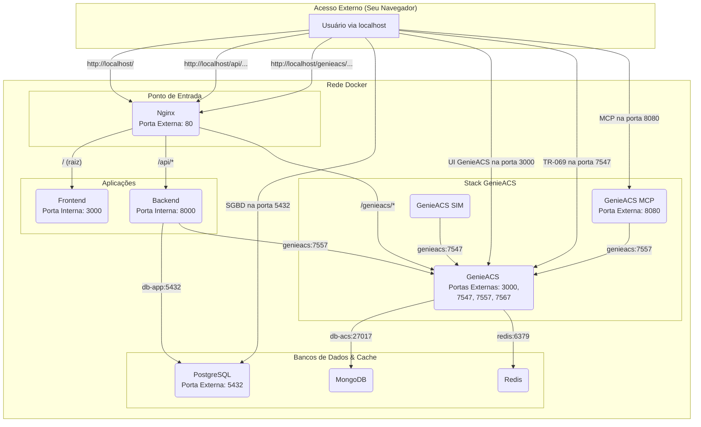

# Guia do Ambiente de Desenvolvimento Local

Este documento descreve a arquitetura, configuração e execução do ambiente de desenvolvimento completo do **RJChronosConnect** utilizando Docker e Docker Compose.

O ambiente foi projetado para espelhar a arquitetura de produção, garantindo consistência e minimizando surpresas no deploy.

## 1. Pré-requisitos

Antes de começar, garanta que você tenha os seguintes softwares instalados e em execução na sua máquina:

- [Docker Engine](https://docs.docker.com/engine/install/)
- [Docker Compose](https://docs.docker.com/compose/install/)

## 2. Iniciando o Ambiente

Com os pré-requisitos instalados, iniciar todo o ecossistema de microsserviços é um processo de um único comando.

1. **Clone o repositório** (caso ainda não o tenha feito).
2. **Crie seu arquivo `.env`**: Copie o arquivo `.env.example` e renomeie a cópia para `.env`. Preencha as variáveis de ambiente conforme necessário.
3. **Navegue até a raiz do projeto** pelo seu terminal.
4. **Execute o seguinte comando:**
   ```bash
   docker-compose up --build
   ```
   - O argumento `--build` é necessário na primeira vez para construir as imagens customizadas (`frontend`, `backend`, `genieacs`).
   - Nas próximas vezes, você pode usar apenas `docker-compose up`.

O terminal exibirá os logs de todos os contêineres sendo iniciados. Este processo pode levar alguns minutos na primeira execução.

## 3. Arquitetura e Serviços

O ambiente é composto por 9 serviços orquestrados pelo Docker Compose, cada um com uma responsabilidade específica. A comunicação interna é feita através de uma rede Docker privada, onde os serviços se encontram usando seus nomes.

### 3.1. Diagrama da Arquitetura de Rede

Este diagrama ilustra como os serviços se conectam, as portas expostas e o fluxo de dados principal.



### 3.2. Detalhamento dos Contêineres

| Serviço | Propósito | Detalhes e Portas |
| :--- | :--- | :--- |
| **`reverse-proxy`** | Ponto de Entrada Único | Contêiner **Nginx**. Roteia todo o tráfego da porta `80` para os serviços internos (`frontend`, `backend`, `genieacs`) com base na URL. |
| **`frontend`** | Interface do Usuário | Aplicação **React (Vite)**. Responsável por toda a experiência visual do usuário. Acessada via Nginx. |
| **`backend`** | API Principal | Aplicação **Python (FastAPI)**. Contém a lógica de negócio, regras e comunicação com o banco de dados principal. Acessada via Nginx pela rota `/api`. |
| **`genieacs`** | Servidor ACS | O coração do gerenciamento de dispositivos. **Expõe várias portas**: `7547` (TR-069), `7557` (API NBI), `3000` (Nova UI). |
| **`db-app`** | Banco de Dados Principal | Instância **PostgreSQL**. Armazena os dados da aplicação (usuários, configurações, etc.). Acessível externamente na porta `5432`. |
| **`db-acs`** | Banco de Dados do GenieACS | Instância **MongoDB**. Usado exclusivamente pelo GenieACS para armazenar dados de dispositivos (parâmetros, logs, etc.). |
| **`redis`** | Cache | Instância **Redis**. Usado pelo GenieACS para cache e gerenciamento de tarefas, melhorando a performance. |
| **`genieacs-mcp`** | Cliente de Testes | Um cliente para interagir com a API do GenieACS. Útil para debug. Acessível na porta `8080`. |
| **`genieacs-sim`** | Simulador de CPEs | Ferramenta para simular dispositivos (CPEs) se conectando ao GenieACS. Essencial para testes de provisionamento. |

## 4. Fluxo de Trabalho de Desenvolvimento

O ambiente suporta **Hot-Reloading** para os serviços `frontend` e `backend`.

- Qualquer alteração nos arquivos dentro da pasta `frontend/src` ou `backend/` será detectada automaticamente, e o servidor de desenvolvimento correspondente será recarregado instantaneamente, sem a necessidade de reiniciar os contêineres.

## 5. Comandos Úteis do Docker Compose

- **Iniciar o ambiente em background:**
  ```bash
  docker-compose up -d
  ```

- **Ver os logs de todos os serviços em tempo real:**
  ```bash
  docker-compose logs -f
  ```

- **Ver os logs de um serviço específico (ex: `backend`):**
  ```bash
  docker-compose logs -f backend
  ```

- **Parar e remover os contêineres:**
  ```bash
  docker-compose down
  ```

- **Parar e remover contêineres E os volumes de dados (útil para começar do zero):**
  ```bash
  docker-compose down -v
  ```

- **Acessar o terminal de um contêiner em execução (ex: `backend`):**
  ```bash
  docker-compose exec backend bash
  ```