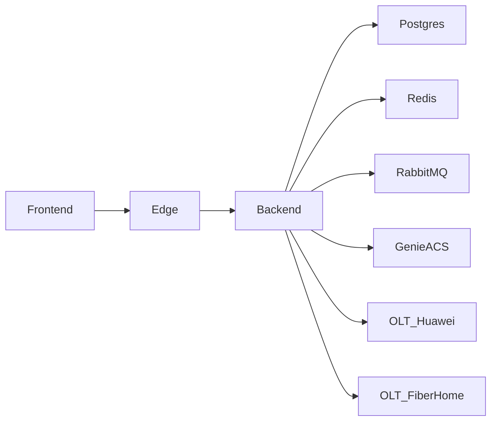

# Servico: backend

O backend e a API central do RJChronosConnect. Ele concentra a logica de negocio, integra servicos externos e garante a consistencia dos dados da plataforma.

## Visao geral

- API principal em FastAPI.
- Orquestra comunicacao com bancos, ACS e mensageria.
- Responsavel por regras de negocio, validacoes e autorizacao.

## Diagrama

## Como funciona no projeto atual

1) O frontend envia requisicoes via edge.
2) O backend valida dados, permissoes e regras.
3) Dados persistentes vao para o PostgreSQL.
4) Operacoes assincronas sao publicadas no RabbitMQ.
5) Resultados temporarios podem ser lidos no Redis.
6) Integracoes com GenieACS e OLT managers executam acoes de campo.

## O que ele faz

- Expor endpoints para inventario, diagnostico e configuracao.
- Integrar com GenieACS para comandos TR-069.
- Enfileirar tarefas via RabbitMQ e consumir resultados no Redis.
- Integrar com OLT managers (Huawei/FiberHome).
- Persistir dados no PostgreSQL.

## Integracoes e dependencias

- db-app (PostgreSQL) para dados de negocio.
- redis para cache e resultados de tarefas.
- rabbitmq para mensageria assincrona.
- genieacs para operacoes TR-069.
- olt-manager-huawei e olt-manager-fiberhome para operacoes em OLT.

## Variaveis de ambiente

- DATABASE_URL: conexao com PostgreSQL.
- GENIACS_API_URL: URL interna do GenieACS.
- OLT_MANAGER_URL: URL base do OLT manager principal.
- RABBITMQ_DEFAULT_USER: usuario do RabbitMQ.
- RABBITMQ_DEFAULT_PASS: senha do RabbitMQ.
- REDIS_PASSWORD: senha do Redis.
- CREDENTIAL_ENCRYPTION_KEY: chave de criptografia de credenciais.

## Casos de uso comuns

- Dashboard com dados atualizados de inventario e status.
- Provisionamento de configuracoes em lote.
- Diagnostico remoto (parametros, optico, trafego).
- Integracao com OLT para consulta e manutencao.

## Configuracao e operacao

- Variaveis de ambiente definem URLs de servicos e credenciais.
- Em dev, costuma estar exposto na porta 8000.
- Logs e niveis de debug sao controlados por configuracao.
