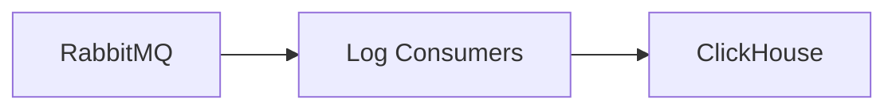

# Servico: clickhouse

O clickhouse e o banco analitico usado para armazenar e consultar logs e eventos em alto volume.

## Visao geral

- Otimizado para analise de grandes volumes de dados.
- Consultas rapidas para observabilidade operacional.
- Suporta agregacoes e series temporais.

## Diagrama

## Papel no fluxo da aplicacao

1) Eventos e logs sao publicados na mensageria.
2) Consumers persistem esses dados no ClickHouse.
3) Consultas analiticas fornecem visibilidade de operacao.

## O que ele faz

- Armazenar eventos e logs centralizados.
- Permitir consultas de alto desempenho.
- Facilitar investigacao e auditoria.

## Integracoes e dependencias

- log-consumer-clickhouse (quando habilitado).
- rabbitmq (origem dos eventos).

## Variaveis de ambiente

- CLICKHOUSE_DB: nome do banco de logs.
- CLICKHOUSE_USER: usuario padrao.
- CLICKHOUSE_DEFAULT_ACCESS_MANAGEMENT: habilita gerenciamento de acesso.

## Casos de uso comuns

- Analise de incidentes e falhas.
- Verificacao de tendencias de performance.
- Auditoria de eventos operacionais.

## Observacoes de operacao

- Em dev, portas comuns: 8123 (HTTP) e 9000 (TCP).
- Deve ter politica de retencao de dados.
