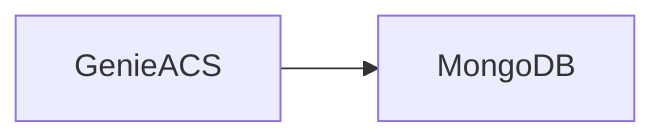

# Servico: db-acs (MongoDB)

O db-acs e o banco utilizado pelo GenieACS. Ele armazena dados e estado gerado pelo ACS durante as interacoes TR-069.

## Visao geral

- Banco MongoDB dedicado ao GenieACS.
- Armazena informacoes operacionais e estados de dispositivos.
- Otimizado para registros sem esquema rigido.

## Diagrama

## Papel no fluxo da aplicacao

1) O ACS registra e atualiza informacoes dos dispositivos.
2) Os dados ficam persistidos no MongoDB.
3) O ACS consulta essas informacoes para novos comandos.

## O que ele faz

- Persistir dados de sessao e parametros de dispositivos.
- Guardar historico operacional do ACS.
- Sustentar o funcionamento interno do GenieACS.

## Integracoes e dependencias

- genieacs (principal consumidor).

## Variaveis de ambiente

- Nao ha variaveis obrigatorias definidas no compose atual.

## Casos de uso comuns

- Manter o estado do dispositivo entre conexoes.
- Permitir que o ACS execute comandos com contexto.
- Armazenar parametros lidos via TR-069.

## Observacoes de operacao

- Em dev, costuma estar exposto na porta 27017.
- Backup e manutencao sao importantes para historico do ACS.
