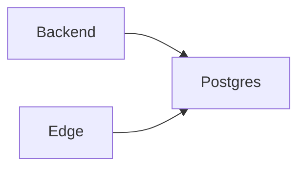

# Servico: db-app (PostgreSQL)

O db-app e o banco relacional principal do RJChronosConnect. Ele guarda os dados de negocio e garante consistencia transacional.

## Visao geral

- Banco PostgreSQL para dados estruturados.
- Fonte de verdade para usuarios, dispositivos e configuracoes.
- Base para relatorios e auditoria.

## Diagrama

## Papel no fluxo da aplicacao

1) O backend valida e processa requisicoes.
2) Dados sao persistidos no PostgreSQL.
3) Consultas alimentam dashboards e relatorios.

## O que ele faz

- Persistir dados de usuarios e permissoes.
- Registrar inventario e configuracoes de dispositivos.
- Armazenar historicos e metadados da operacao.

## Integracoes e dependencias

- backend (principal consumidor).
- edge (auth pode utilizar a base).

## Variaveis de ambiente

- POSTGRES_DB: nome do banco.
- POSTGRES_USER: usuario do banco.
- POSTGRES_PASSWORD: senha do banco.

## Casos de uso comuns

- Cadastro e gestao de clientes e dispositivos.
- Consultas estruturadas para relatorios.
- Controle de configuracoes e politicas do sistema.

## Observacoes de operacao

- Em dev, costuma estar exposto na porta 5432.
- Backup e manutencao sao essenciais para dados criticos.
