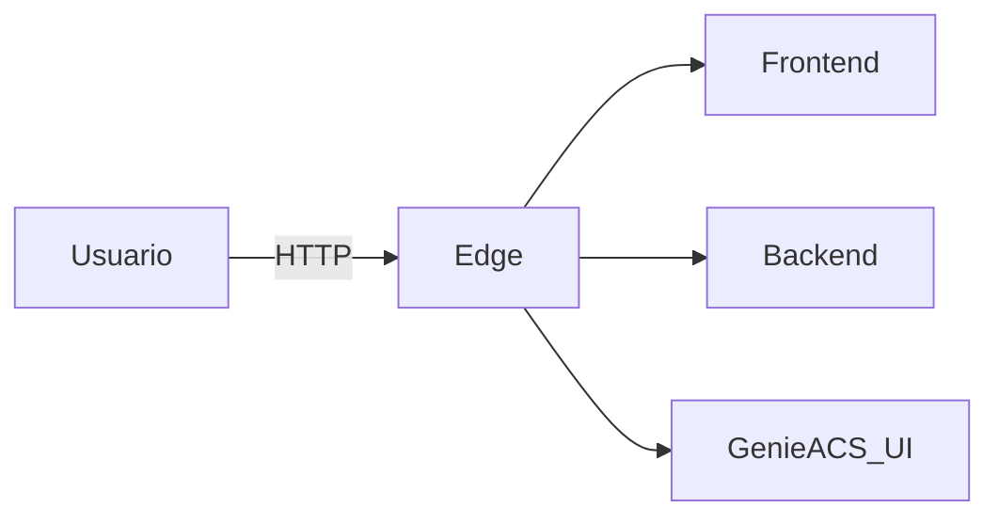

# Servico: edge

O edge e o gateway de entrada do RJChronosConnect. Ele concentra o acesso publico e orquestra o roteamento interno entre frontend, backend e GenieACS UI.

## Visao geral

- Atua como ponto unico de entrada da plataforma.
- Expoe a aplicacao para o usuario final.
- Encaminha trafego para servicos internos sem expor portas diretamente.

## Diagrama

## Papel no fluxo da aplicacao

1) O usuario acessa a plataforma via navegador.
2) O edge entrega a UI (ou encaminha para o dev server do frontend).
3) Chamadas de API passam pelo edge e seguem para o backend.
4) Rotas de UI do GenieACS sao expostas pelo edge quando necessario.

## O que ele faz

- Servir arquivos da UI (ou proxyar o frontend em dev).
- Proxy reverso para rotas de API do backend.
- Centralizar autenticacao e politicas de acesso.
- Padronizar headers e caminhos (ex: base de auth).

## Integracoes e dependencias

- Backend (API principal).
- Banco PostgreSQL (para autenticacao, via Better Auth).
- GenieACS (UI e API interna, quando habilitado).

## Variaveis de ambiente

- EDGE_HOST: host de bind do gateway.
- EDGE_PORT: porta publica do edge.
- BACKEND_INTERNAL_URL: URL interna do backend.
- GENIEACS_UI_INTERNAL_URL: URL interna da UI do GenieACS.
- FRONTEND_DEV_URL: URL do dev server do frontend (dev).
- BETTER_AUTH_DATABASE_URL: conexao com o PostgreSQL para auth.
- BETTER_AUTH_BASE_PATH: base das rotas de autenticacao.
- BETTER_AUTH_BASE_URL: URL base externa do auth.
- BETTER_AUTH_TRUSTED_ORIGINS: origens confiaveis do auth.
- EDGE_LEGACY_AUTH_PROXY_ENABLED: habilita proxy legado.
- EDGE_LEGACY_AUTH_PROXY_HEADER: header do proxy legado.
- EDGE_LEGACY_AUTH_PROXY_TOKEN: token do proxy legado.

## Casos de uso comuns

- Entrada unica para a plataforma (menos portas expostas).
- Aplicar autenticacao e controle de acesso em um unico ponto.
- Separar publicamente o que e UI e o que e API.

## Observacoes de operacao

- Em dev, normalmente exposto na porta 8081.
- Variaveis de ambiente controlam URLs internas e politicas de auth.
