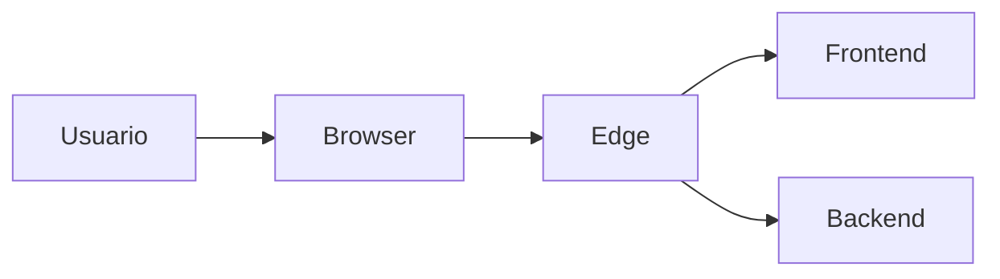

# Servico: frontend

O frontend e a camada de interface do RJChronosConnect. Ele transforma as operacoes de rede em telas, dashboards e fluxos simples para o time de operacao.

## Visao geral

- Aplicacao web em React/Vite.
- Consome a API do backend via gateway.
- Foca em experiencia de uso, velocidade e produtividade operacional.

## Diagrama

## Como funciona no projeto atual

1) O usuario acessa o sistema pelo navegador.
2) O edge entrega o frontend (ou proxya o dev server em dev).
3) O frontend chama a API do backend para buscar dados.
4) As respostas viram tabelas, cards e dashboards na UI.

## O que ele faz

- Exibe inventario e status de dispositivos.
- Permite diagnostico remoto e consulta de parametros.
- Executa fluxos de provisionamento e configuracao.
- Apresenta alertas, historicos e indicadores operacionais.

## Integracoes e dependencias

- Edge (gateway de acesso e proxy).
- Backend (API principal).

## Variaveis de ambiente

- VITE_BACKEND_PROXY_TARGET: alvo do proxy da API no dev server.
- VITE_OLT_MANAGER_PROXY_TARGET: alvo do proxy para OLT manager (dev).

## Casos de uso comuns

- Operador consulta status de ONUs/CPEs em tempo real.
- Time de suporte aplica configuracoes em lote.
- Analista acompanha alertas e indicadores em dashboards.

## Observacoes de operacao

- Em dev, o Vite costuma estar exposto na porta 3000.
- Em prod, o frontend e servido pelo edge.
- Variaveis de ambiente definem o alvo do proxy para a API.
