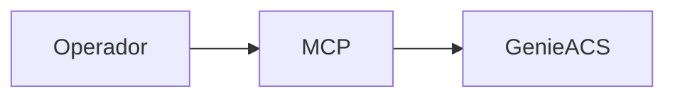

# Servico: genieacs-mcp

O genieacs-mcp e um painel auxiliar para administracao do GenieACS. Ele e usado para operacao assistida, verificacoes rapidas e debugging.

## Visao geral

- UI complementar ao GenieACS.
- Voltado para tarefas operacionais e validacao em ambiente de dev.
- Nao e o caminho principal de uso dos usuarios finais.

## Diagrama

## Papel no fluxo da aplicacao

1) Operador acessa o painel do MCP.
2) Consulta informacoes do ACS e dispositivos.
3) Executa verificacoes ou testes pontuais.

## O que ele faz

- Exibe dados e estado do ACS.
- Permite consultas e inspecao de informacoes dos dispositivos.
- Ajuda no troubleshooting de operacoes TR-069.

## Integracoes e dependencias

- genieacs (ACS principal).
- Credenciais de acesso configuradas via ambiente.

## Variaveis de ambiente

- ACS_URL: URL do GenieACS.
- ACS_USER: usuario de acesso.
- ACS_PASS: senha de acesso.

## Casos de uso comuns

- Validar se o ACS recebeu e processou comandos.
- Conferir dados de um dispositivo especifico.
- Apoiar diagnostico de problemas em dev.

## Observacoes de operacao

- Em dev, costuma estar exposto como 8082 -> 8080.
- Acesso pode variar conforme compose utilizado.
