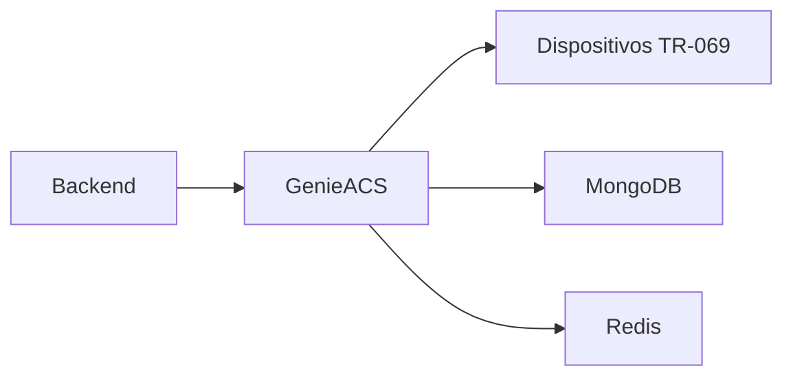

# Servico: genieacs

O genieacs e o servidor ACS (TR-069) do projeto. Ele e responsavel por registrar dispositivos, executar comandos e manter o estado de CPEs/ONUs.

## Visao geral

- Implementa o protocolo TR-069.
- Gerencia ciclo de vida de conexoes com dispositivos.
- Mantem estado e parametros em banco dedicado (MongoDB).

## Diagrama

## Como funciona no projeto atual

1) Dispositivos se conectam ao ACS (genieacs).
2) O backend solicita operacoes ao ACS via API.
3) O ACS executa comandos e coleta parametros.
4) Resultados ficam persistidos no MongoDB e retornam ao backend.

## O que ele faz

- Registrar e manter o estado dos dispositivos.
- Executar comandos remotos (get/set de parametros).
- Disparar provisionamento e configuracoes em massa.
- Armazenar historico e dados de TR-069.

## Integracoes e dependencias

- db-acs (MongoDB) para persistencia do ACS.
- redis (quando habilitado pelo ACS).
- backend como orquestrador das acoes.

## Variaveis de ambiente

- GENIEACS_MONGODB_CONNECTION_URL: string de conexao com MongoDB.
- GENIEACS_REDIS_HOST: host do Redis (se usado pelo ACS).
- GENIEACS_UI_JWT_SECRET: segredo da UI do GenieACS.
- GENIEACS_DEBUG_FILE: arquivo de debug (log).
- GENIEACS_DEBUG_FORMAT: formato do debug.

## Casos de uso comuns

- Ativar e configurar Wi-Fi em novas ONUs.
- Coletar parametros de diagnostico remoto.
- Atualizar firmware de dispositivos em lote.
- Sincronizar inventario tecnico com a plataforma.

## Configuracao e operacao

- Variaveis de ambiente controlam conexao com MongoDB e Redis.
- Porta TR-069 tipica: 7547 (varia por ambiente).
- A UI pode ser exposta via edge ou genieacs-mcp.
