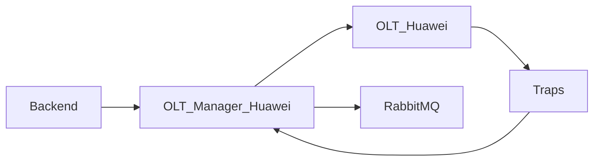

# Servico: olt-manager-huawei

O olt-manager-huawei e o microservico dedicado a integracao com OLTs Huawei. Ele encapsula protocolos, comandos e regras do fabricante para que o backend principal nao precise conhecer detalhes do equipamento.

## Visao geral

- Microservico FastAPI com arquitetura orientada a dominios (OLT e ONT).
- Suporta operacoes via SSH (CLI) e SNMP.
- Publica eventos e alarmes em mensageria.
- Otimizado para producao com connection pool de SSH e parsing robusto.

## Diagrama

## Como funciona no projeto atual

1) O backend solicita uma operacao de OLT/ONT pela API interna do microservico.
2) O olt-manager executa comandos no equipamento (SSH/SNMP) e normaliza a resposta.
3) Resultados voltam ao backend, que expoe para o frontend.
4) Eventos de estado (traps SNMP) podem ser publicados em RabbitMQ.

Fluxos tipicos:
- Diagnostico de ONT: backend -> olt-manager -> OLT -> resposta -> backend.
- Eventos: OLT -> trap listener -> olt-manager -> RabbitMQ -> consumidores.

## O que ele faz

- Executa comandos de gestao da OLT (porta, VLAN, usuarios, backup).
- Gerencia ONTs (provisionamento, reboot, optico, trafego).
- Coleta informacoes de hardware e estado do equipamento.
- Expoe endpoints organizados por dominio (OLT, ONT e Health).

## Casos de uso comuns

- Provisionar novas ONTs e confirmar autofind.
- Consultar potencia optica, trafego e status de portas.
- Reboot de ONT em campo por demanda de suporte.
- Criar e associar VLANs e service-ports.
- Monitorar alarmes como LOS e eventos de powerfail.
- Gerar backup e restaurar configuracao da OLT.

## Integracoes e dependencias

- Backend: chama a API do microservico para operacoes de OLT/ONT.
- RabbitMQ: publicacao de eventos (quando habilitado).
- OLT Huawei: conexao via SSH e SNMP.

## Variaveis de ambiente

- BACKEND_API_URL: URL do backend para integracoes internas.
- RABBITMQ_HOST: host do RabbitMQ.
- RABBITMQ_PORT: porta do RabbitMQ.
- RABBITMQ_DEFAULT_USER: usuario do RabbitMQ.
- RABBITMQ_DEFAULT_PASS: senha do RabbitMQ.
- TRAP_LISTENER_HOST: host do listener de traps.
- TRAP_LISTENER_PORT: porta do listener de traps.
- SNMP_COMMUNITY: comunidade SNMP padrao.
- TEST_OLT_IP: OLT de testes (opcional).
- TEST_OLT_MODEL: modelo da OLT de testes.
- OLT_IP_MODEL_MAPPING: mapeamento IP -> modelo (JSON).
- SSH_POOL_MAX_SIZE: tamanho maximo do pool SSH.
- SSH_POOL_IDLE_TIMEOUT: timeout de conexao ociosa.
- SSH_POOL_CONNECTION_TIMEOUT: timeout de conexao SSH.
- NETMIKO_SESSION_LOG: habilita log de sessao Netmiko.

## Estrutura e dominios internos (resumo)

- OLT Domain: portas, VLANs, usuarios, backup, hardware.
- ONT Domain: provisionamento, info optica, trafego, service-ports.
- Health Domain: health check e estatisticas de conexao.

## Configuracao e runtime

- Variaveis de ambiente controlam conexoes com RabbitMQ, SNMP e backend.
- Um arquivo `olt_config.yaml` pode listar OLTs conhecidas e credenciais.
- Em dev, costuma rodar na porta 8001.

## Scripts (visao superficial)

- Existem scripts auxiliares dentro do servico (ex: `scripts/update_class_names.py`).
- O repositorio tambem possui scripts gerais em `scripts/` para automacoes do ambiente.
- Detalhamento completo ficara na documentacao de scripts.

## Observacoes de operacao

- Recomendado usar credenciais e enderecos de OLT via variaveis de ambiente.
- O connection pool evita overhead de conexoes SSH repetidas.
- Parsing robusto ajuda a suportar diferentes firmwares Huawei.
