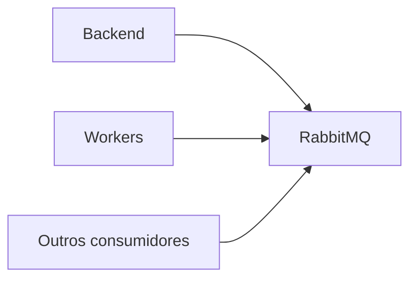

# Servico: rabbitmq

O rabbitmq e o broker de mensagens da plataforma. Ele garante comunicacao assincrona e confiavel entre servicos.

## Visao geral

- Fila de mensagens para desacoplar produtores e consumidores.
- Suporta tarefas pesadas sem bloquear a API.
- Garante entrega e retentativas conforme configuracao.

## Diagrama

## Papel no fluxo da aplicacao

1) O backend publica uma tarefa na fila.
2) Workers ou microservicos consomem a mensagem.
3) O resultado e persistido (ex: Redis ou banco).

## O que ele faz

- Enfileirar tarefas de longa duracao.
- Distribuir mensagens entre varios consumidores.
- Servir como base para integracoes internas.

## Integracoes e dependencias

- backend (produtor de tarefas).
- works e outros consumidores (processamento).
- log-consumers (quando habilitados).

## Variaveis de ambiente

- RABBITMQ_DEFAULT_USER: usuario padrao.
- RABBITMQ_DEFAULT_PASS: senha padrao.

## Casos de uso comuns

- Provisionamento em massa de dispositivos.
- Processos de diagnostico que demoram mais tempo.
- Integracoes com OLT managers e pipelines internos.

## Observacoes de operacao

- Em dev, UI de gerenciamento costuma estar na porta 15672.
- A porta de mensageria padrao e 5672.
