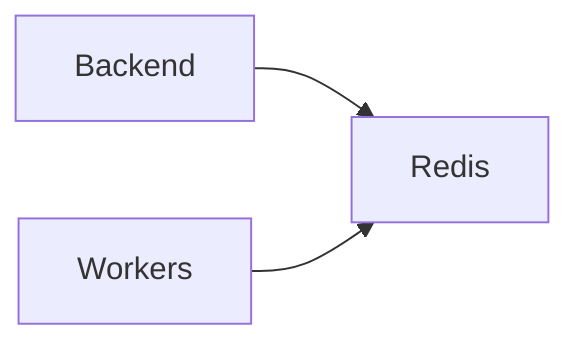

# Servico: redis

O redis e usado como armazenamento em memoria para dados temporarios e resultados de tarefas.

## Visao geral

- Baixa latencia para leituras e escritas frequentes.
- Suporte a cache e estados transitorios.
- Facilita escalabilidade das operacoes.

## Diagrama

## Papel no fluxo da aplicacao

1) O backend dispara uma tarefa assincrona.
2) O processamento grava resultados no Redis.
3) O backend consulta o Redis para responder ao usuario.

## O que ele faz

- Guardar resultados temporarios de tarefas.
- Manter cache de dados acessados com frequencia.
- Reduzir carga no banco relacional.

## Integracoes e dependencias

- backend (cache e status de tarefas).
- works (processamento assincrono, quando habilitado).

## Variaveis de ambiente

- REDIS_PASSWORD: senha para acesso (quando habilitado).

## Casos de uso comuns

- Consultar status de execucoes longas.
- Armazenar respostas de consultas repetitivas.
- Compartilhar estados volateis entre servicos.

## Observacoes de operacao

- Em dev, costuma estar exposto na porta 6379.
- Pode exigir senha via variavel de ambiente.
