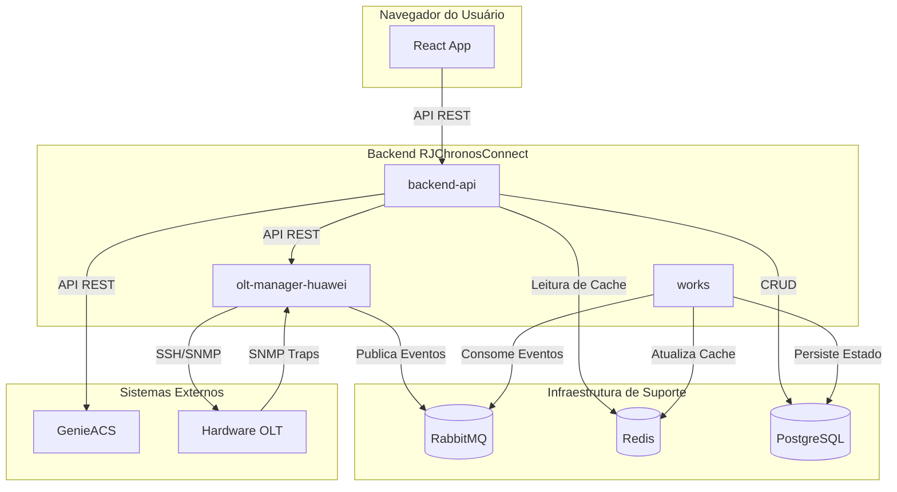
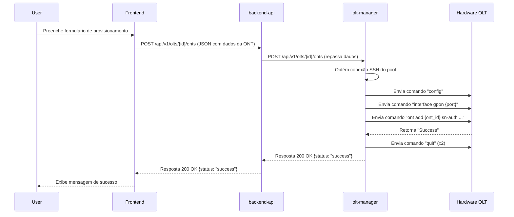
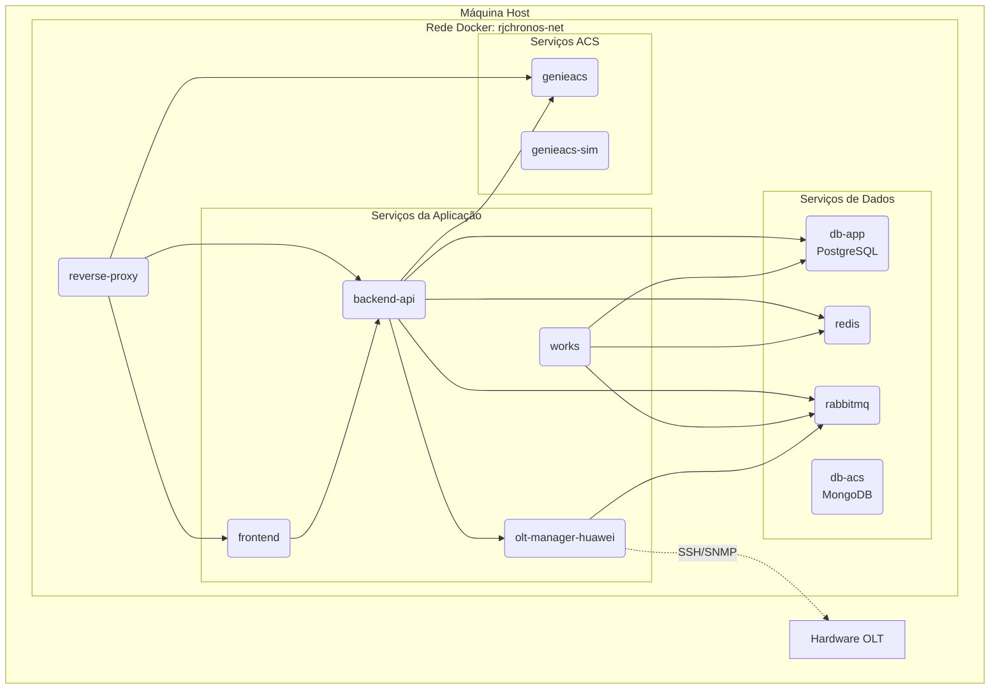

# Visão Geral da Arquitetura - RJChronosConnect

**Versão:** 1.0
**Data:** 2025-09-11

Este documento fornece uma visão geral da arquitetura de software do sistema RJChronosConnect, com foco na estrutura do backend. Ele serve como um guia para desenvolvedores, arquitetos e equipes de operações, utilizando o **Modelo de Visão 4+1** como base.

---

## 1. Padrões de Arquitetura

A arquitetura do sistema é uma composição de padrões modernos que visam escalabilidade, resiliência e manutenibilidade:

-   **Arquitetura de Microsserviços (Microservices Architecture):** O sistema é decomposto em serviços independentes e com responsabilidades únicas (`backend-api`, `olt-manager-huawei`, `works`). Cada serviço é implantado como um contêiner Docker, permitindo desenvolvimento, deploy e escalonamento autônomos.

-   **Arquitetura Orientada a Eventos (Event-Driven Architecture - EDA):** Para comunicação assíncrona e de baixo acoplamento, o sistema utiliza um barramento de mensagens (RabbitMQ). Isso é fundamental para o monitoramento em tempo real, onde o `olt-manager` publica eventos (ex: status da ONT) que são consumidos por outros serviços.

-   **Arquitetura em Camadas (Layered Architecture):** O serviço `backend-api` é internamente estruturado em camadas lógicas (API, Serviços, CRUD, Modelos), promovendo uma clara separação de responsabilidades e facilitando a manutenção.

---

## 2. Visão Lógica e de Processos

*Esta seção aborda duas visões do modelo 4+1: a **Visão Lógica**, que descreve os blocos funcionais, e a **Visão de Processos**, que descreve como esses blocos interagem dinamicamente.*

### 2.1. Diagrama de Componentes

*Corresponde à **Visão Lógica**. O diagrama abaixo ilustra os principais componentes do sistema e suas dependências diretas, mostrando "o que" o sistema faz.*

### 2.2. Diagrama de Sequência: Provisionamento de ONT

*Corresponde à **Visão de Processos**. Este diagrama detalha o fluxo de comunicação passo a passo para um caso de uso crítico, mostrando "como" os componentes colaboram.*

---

## 3. Visão Física (Implantação)

*Esta seção corresponde à **Visão Física**, descrevendo a topologia de implantação do software, ou seja, "onde" o software é executado.*

A infraestrutura é totalmente containerizada usando Docker e orquestrada via `docker-compose`.

### 3.1. Diagrama de Implantação

Este diagrama representa a topologia do ambiente de desenvolvimento.

---

## 4. Visão de Desenvolvimento

*Esta seção corresponde à **Visão de Desenvolvimento**, descrevendo a organização do código-fonte para facilitar o trabalho dos programadores.*

A organização do código-fonte dentro de cada microsserviço segue padrões bem definidos para facilitar a manutenção.

-   **`backend-api` e `olt-manager-huawei`:**
    -   **`main.py`**: Ponto de entrada da aplicação FastAPI.
    -   **`api/`**: Módulos de rota, definindo os endpoints.
    -   **`schemas/`**: Modelos Pydantic para validação e serialização de dados.
    -   **`services/`**: Camada que contém a lógica de negócio principal.
    -   **`crud/`**: Funções para interação direta com o banco de dados (Data Access Layer).
    -   **`models/`**: Definições de tabelas do banco de dados (SQLAlchemy).
    -   **`core/`**: Configurações, logging, exceções e outros componentes centrais.

-   **`works`:**
    -   **`main.py`**: Script principal que inicializa o consumidor RabbitMQ e a conexão com o Redis.

---

## 5. Decisões de Arquitetura (Architectural Decision Records - ADRs)

*Esta seção corresponde à **Visão de Cenários (+1)**, que amarra todas as outras visões ao registrar o histórico e a justificativa ("porquê") das decisões arquiteturais.*

Esta seção deve ser usada para registrar decisões de arquitetura importantes de forma imutável.

### ADR-001: Adoção da Arquitetura de Microsserviços

-   **Status:** Decidido
-   **Contexto:** A necessidade de gerenciar diferentes domínios (lógica de negócio, interação com hardware, processamento de tarefas) de forma independente e escalável.
-   **Decisão:** Decompor o backend em serviços menores e especializados.
-   **Consequências:**
    -   **Positivas:** Maior resiliência, escalabilidade individual dos serviços, equipes podem trabalhar em paralelo.
    -   **Negativas:** Maior complexidade operacional (deployment, monitoramento), necessidade de um barramento de eventos.

*(Adicionar novos ADRs aqui conforme decisões forem tomadas)*