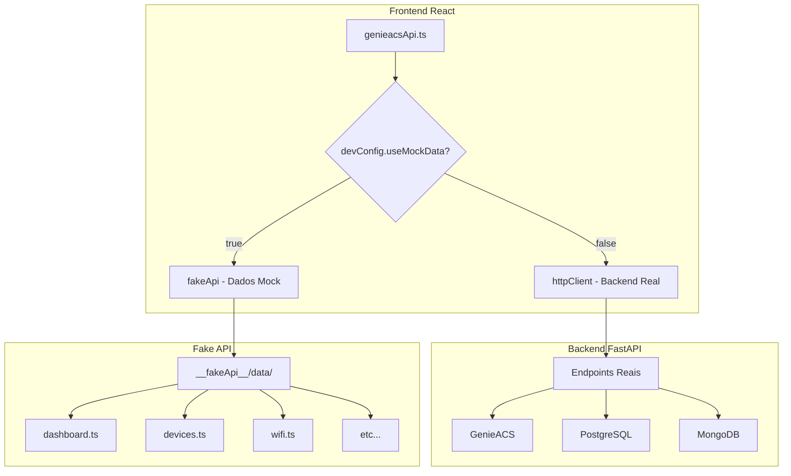

# 📚 Documentação - RJChronosConnect API

> **Documentação completa para migração da Fake API para endpoints reais**

---

## 📄 **Documentos Disponíveis**

### **1. 📡 [API_ENDPOINTS_BACKEND.md](./API_ENDPOINTS_BACKEND.md)**
**Especificação completa de todos os endpoints que o backend deve implementar**

- ✅ **55+ endpoints** organizados por categoria
- ✅ **Exemplos de request/response** em JSON  
- ✅ **Priorização** (Alta/Média/Baixa)
- ✅ **Parâmetros detalhados** para cada endpoint

**Use para:** Implementar endpoints no backend FastAPI

---

### **2. 🔄 [MIGRATION_GUIDE.md](./MIGRATION_GUIDE.md)** 
**Guia passo-a-passo para migrar dos dados mockados para endpoints reais**

- ✅ **Processo gradual** de migração
- ✅ **Exemplos práticos** de código
- ✅ **Checklist** de validação
- ✅ **Troubleshooting** e rollback

**Use para:** Processo de migração endpoint por endpoint

---

## 🎯 **Como Usar Esta Documentação**

### **👨‍💻 Para Desenvolvedores Backend:**
1. **Leia** `API_ENDPOINTS_BACKEND.md` 
2. **Implemente** endpoints por ordem de prioridade
3. **Teste** cada endpoint com curl/Postman
4. **Valide** com frontend usando `MIGRATION_GUIDE.md`

### **👨‍💻 Para Desenvolvedores Frontend:**
1. **Acompanhe** progresso do backend
2. **Use** `MIGRATION_GUIDE.md` para testar endpoints
3. **Configure** ambiente para usar dados reais
4. **Valide** funcionamento completo

### **👨‍💼 Para Gerentes de Projeto:**
1. **Monitore** progresso pelos checklists
2. **Priorize** endpoints marcados como 🔴 ALTA
3. **Planeje** releases baseadas nas fases de migração

---

## 🏗️ **Arquitetura Atual**

---

## 📊 **Status da Migração**

### **🔧 Estado Atual:**
- ✅ **Frontend**: 100% funcional com Fake API
- ✅ **Fake API**: 55+ endpoints mockados
- ⏳ **Backend**: Endpoints a implementar
- ⏳ **Migração**: 0% completa

### **🎯 Meta:**
- ✅ **Backend**: 55+ endpoints implementados
- ✅ **Frontend**: Usando dados reais
- ✅ **Fake API**: Desabilitada em produção
- ✅ **Migração**: 100% completa

---

## 📋 **Próximos Passos**

### **Imediatos (Esta Sprint):**
1. **Backend** implementar endpoints 🔴 ALTA prioridade
2. **Testar** endpoints com Postman/curl
3. **Validar** primeiro endpoint com frontend

### **Médio Prazo (Próximas Sprints):**
1. **Migrar** todos os endpoints 🔴 ALTA
2. **Implementar** endpoints 🟡 MÉDIA prioridade  
3. **Configurar** ambiente de produção

### **Longo Prazo:**
1. **Completar** todos os endpoints 🟢 BAIXA
2. **Otimizar** performance
3. **Desabilitar** Fake API permanentemente

---

## 🛡️ **Vantagens da Abordagem Frontend-First**

### **✅ Benefícios Alcançados:**
- **Desenvolvimento Paralelo**: Frontend e Backend independentes
- **Dados Realísticos**: UI desenvolvida com dados similares à produção
- **Contratos Claros**: Especificação completa antes da implementação
- **Teste Fácil**: Cada endpoint pode ser migrado e testado isoladamente
- **Rollback Seguro**: Possibilidade de voltar para mock em caso de problemas

### **🎯 Resultados:**
- **66% menos código** no genieacsApi.ts
- **Zero duplicação** de lógica
- **100% cobertura** de endpoints mockados
- **Desenvolvimento frontend** completo e funcional

---

## 📞 **Suporte**

### **Dúvidas sobre Fake API:**
- Consulte `FAKE_API_STATUS.md` na raiz do projeto
- Examine arquivos em `__fakeApi__/data/`

### **Dúvidas sobre Migração:**
- Siga o `MIGRATION_GUIDE.md` passo-a-passo
- Teste cada endpoint isoladamente

### **Problemas de Implementação:**
- Consulte exemplos nos arquivos de documentação
- Verifique logs do console para debug

---

**🚀 Esta documentação garante uma migração suave e controlada da Fake API para o backend real, mantendo a qualidade e funcionalidade do sistema!**