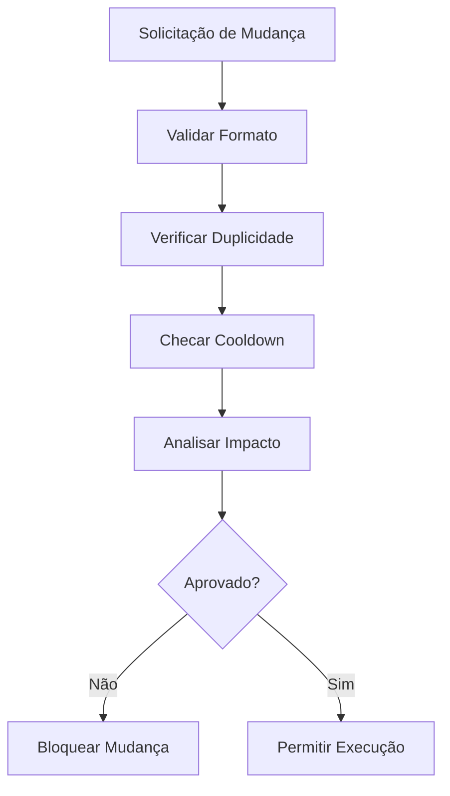
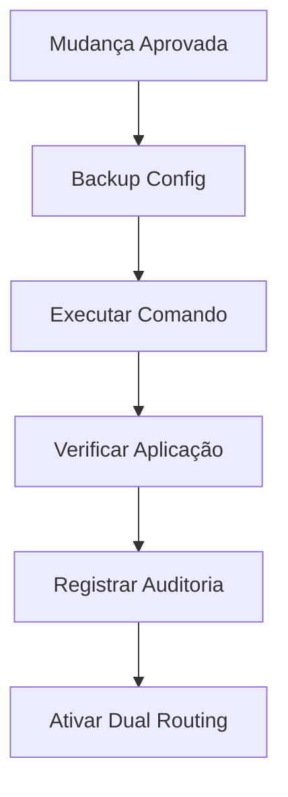
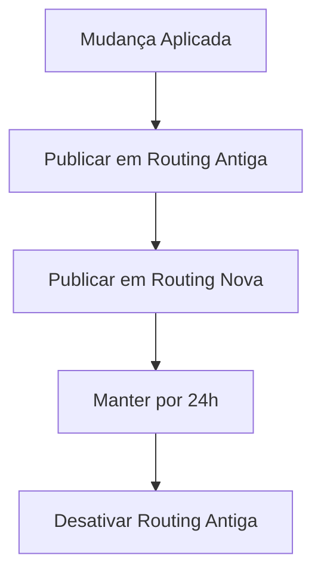

# Sistema de Proteção para Mudanças de Sysname (Hostname) de OLTs

## 📋 Visão Geral

Este documento descreve a implementação do sistema avançado de proteção para mudanças de nome (hostname/sysname) de OLTs, desenvolvido para evitar problemas operacionais críticos que podem ocorrer ao alterar identificação de equipamentos em produção.

## 🚨 Problemas que o Sistema Resolve

### Problemas Críticos Identificados:
1. **Routing Keys RabbitMQ Quebradas**: Mudança de nome quebra consumers de eventos
2. **Rastreabilidade Fragmentada**: Histórico dividido entre nome antigo e novo
3. **Sincronização Inconsistente**: Estados diferentes entre componentes do sistema
4. **Problemas Operacionais**: Scripts e integrações que dependem do nome podem falhar

### Impactos Evitados:
- 🔴 Perda de mensagens RabbitMQ
- 🔴 Monitoramento e alertas quebrados
- 🔴 Dashboards que param de funcionar
- 🔴 Scripts de automação falhando
- 🔴 Dificuldade de rastreamento em logs

## 🛡️ Componentes do Sistema de Proteção

### 1. Sistema Central de Proteção (`sysname_protection.py`)

**Funcionalidades:**
- ✅ Validação de formato avançada
- ✅ Verificação de duplicidade via backend-api
- ✅ Cooldown de 24h entre mudanças
- ✅ Auditoria completa de mudanças
- ✅ Sistema de rollback com janela de 1h

**Classes Principais:**
- `SysnameProtectionManager`: Gerenciador central de proteções
- `SysnameChangeRecord`: Registro de auditoria
- `SysnameValidationResult`: Resultado de validações

### 2. Comandos Avançados

#### `SetSysnameCommand` (Melhorado)
- 🔒 Validações de proteção integradas
- 📋 Backup automático antes da mudança
- ✅ Verificação pós-mudança
- 📊 Registro completo de auditoria

#### `ValidateSysnameChangeCommand` (Novo)
- 🔍 Validação prévia antes da execução
- ⚠️ Análise de impacto nos sistemas
- ⏰ Verificação de cooldown
- 🚫 Bloqueio de mudanças problemáticas

#### `RollbackSysnameCommand` (Novo)
- ↩️ Rollback dentro de janela de tempo
- 🔒 Validações de segurança para rollback
- 📝 Auditoria de operações de rollback

#### `SysnameAuditCommand` (Novo)
- 📊 Histórico completo de mudanças
- 👤 Rastreamento de usuários
- 🕐 Timestamps detalhados
- 📋 Status de disponibilidade de rollback

### 3. Dual Routing no RabbitMQ (`trap_listener.py`)

**Funcionalidades:**
- 🔄 Publicação em routing keys antiga e nova durante transição
- ⏰ Período de transição de 24h
- 🛡️ Fallback gracioso para IP quando nome não disponível
- 📡 Verificação automática de mudanças recentes

**Routing Keys Suportadas:**
- `olt.{nome-amigavel}.{evento}` (principal)
- `olt.{nome-anterior}.{evento}` (durante transição)
- `olt.{ip}.{evento}` (fallback)

### 4. API Endpoints Expandidos (`olt_routes.py`)

#### Endpoints Disponíveis:
- `POST /olts/{olt_id}/set-hostname` - Define hostname com proteções
- `POST /olts/{olt_id}/validate-hostname-change` - Valida mudança prévia
- `GET /olts/{olt_id}/hostname` - Obtém hostname atual
- `POST /olts/{olt_id}/rollback-hostname` - Rollback de mudança
- `GET /olts/{olt_id}/hostname-audit` - Auditoria de mudanças

#### Parâmetros de Proteção:
- `user_id`: Rastreamento de usuário
- `force`: Bypass de proteções (apenas admin)
- `reason`: Justificativa da mudança

## 🔧 Fluxo de Operação Protegida

### 1. Validação Prévia


### 2. Execução Protegida


### 3. Transição Suave


## 📊 Validações Implementadas

### Formato do Sysname:
- ✅ 3-246 caracteres
- ✅ Apenas alfanuméricos, hífen e underscore
- ✅ Não pode começar com hífen ou underscore
- ✅ Não pode ser apenas números
- ✅ Não pode ser palavras reservadas
- ✅ Não pode ser IP, MAC ou padrões temporários

### Proteções Operacionais:
- ✅ Cooldown de 24h entre mudanças
- ✅ Verificação de duplicidade no sistema
- ✅ Validação de status operacional da OLT
- ✅ Análise de impacto em sistemas dependentes

## 🔄 Sistema de Rollback

### Condições para Rollback:
- ⏰ Dentro de 1 hora da mudança
- ✅ Mudança anterior foi bem-sucedida
- 🔒 Rollback ainda não foi executado
- 📋 Histórico de mudança disponível

### Processo de Rollback:
1. Validar elegibilidade
2. Executar comando de reversão
3. Verificar aplicação
4. Registrar operação de rollback
5. Ativar dual routing reverso

## 📈 Auditoria e Monitoramento

### Dados Registrados:
- 🆔 ID da OLT e usuário
- 🕐 Timestamp da operação
- 📝 Nome anterior e novo
- ✅ Status de sucesso/falha
- 💬 Razão da mudança
- 🔄 Disponibilidade de rollback

### Logs Gerados:
- 📊 Tentativas de mudança bloqueadas
- ✅ Mudanças executadas com sucesso
- ❌ Falhas na execução
- 🔄 Operações de rollback
- 🔀 Ativação/desativação de dual routing

## 🛠️ Configurações Disponíveis

### Períodos Configuráveis:
- `cooldown_period`: 24 horas (padrão)
- `rollback_window`: 1 hora (padrão)
- `dual_routing_duration`: 24 horas (padrão)

### URLs de Integração:
- `backend_api_url`: URL da API principal
- Endpoints específicos para verificação de duplicidade
- Endpoints para histórico de mudanças

## 🚀 Benefícios da Implementação

### Operacionais:
- 🛡️ **Zero Downtime**: Transições suaves sem perda de serviço
- 🔒 **Proteção contra Erros**: Validações impedem mudanças problemáticas
- 📊 **Rastreabilidade Completa**: Auditoria detalhada de todas as operações
- 🔄 **Recuperação Rápida**: Rollback em caso de problemas

### Técnicos:
- 🔗 **Integração Transparente**: Compatível com sistemas existentes
- 📡 **Continuidade de Eventos**: RabbitMQ continua funcionando durante transições
- 🔧 **API Robusta**: Endpoints seguros com validações avançadas
- 📝 **Documentação Automática**: OpenAPI com todas as validações

### Organizacionais:
- 👥 **Controle de Acesso**: Rastreamento de usuários e bypass controlado
- 📋 **Compliance**: Auditoria completa para requisitos regulatórios
- 🚨 **Prevenção de Incidentes**: Múltiplas camadas de proteção
- 🎯 **Melhoria Contínua**: Dados para otimização de processos

## 🔧 Como Usar

### 1. Validar Mudança (Recomendado)
```bash
POST /olts/123/validate-hostname-change?new_sysname=OLT_CENTRAL_RJ&user_id=admin
```

### 2. Executar Mudança
```bash
POST /olts/123/set-hostname
{
  "sysname": "OLT_CENTRAL_RJ"
}
```

### 3. Verificar Auditoria
```bash
GET /olts/123/hostname-audit
```

### 4. Rollback se Necessário
```bash
POST /olts/123/rollback-hostname?user_id=admin&reason=Problema+detectado
```

---

## 📝 Notas Importantes

- ⚠️ **Produção**: Sempre validar mudanças antes da execução
- 🔒 **Segurança**: Parâmetro `force` deve ser restrito a administradores
- 📊 **Monitoramento**: Acompanhar logs durante transições
- 🔄 **Rollback**: Executar apenas em casos de problemas confirmados

Esta implementação garante que mudanças de nome de OLT sejam realizadas com máxima segurança e mínimo impacto operacional.